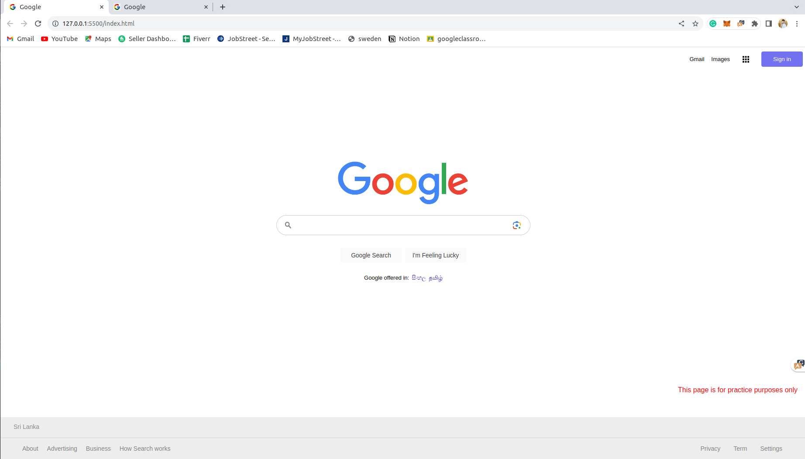

# Google Clone

**Description**: This project is a simple Gooogle clone built using HTML and CSS. It replicates some of the basic functionality and design elements of the Google website for educational purposes and as a demonstration of web development skills. 

**Disclaimer**: This project, titled "Google Clone," is intended for educational and demonstrative purposes only. It is not affiliated with or endorsed by Google Inc. The usage of any Google-related terms, including the Google logo, is purely for illustrative purposes. Users should comply with Google's terms of service and policies while using this project.

Please be aware that this project does not provide access to Google's search engine, databases, or services. Use it responsibly and in accordance with applicable laws and regulations.




## Table of Contents

- [Features](#features)
- [Installation](#installation)
- [Usage](#usage)
- [Contributing](#contributing)
- [License](#license)
- [Acknowledgments](#acknowledgments)
- [Author](#author)

## Features

- The application is designed to be responsive, adapting to different screen sizes and devices.
-  The primary feature of this application is a search bar that mimics Google's search functionality. Users can enter queries and receive search results.

## Installation

1. Clone the repository to your local machine:

    ```bash
    git clone https://github.com/TharinduMDev/Google-Clone
    ```

2. Open the project in a web browser:

    ```bash
    cd Google Clone
    open index.html
    ```

## Usage

The Google Clone Design project serves as a valuable educational resource, offering insights into UI/UX design principles. It can be employed as a reference for design enthusiasts and web developers seeking to grasp effective design choices and user experience enhancements. Furthermore, this project can serve as a strong foundation for initiating your own web design and development endeavors. Explore the project to gain a deeper understanding of its design strategies and the user-centric experience it provides 

## Contributing

Contributions are welcome! If you'd like to contribute to this project, please follow these guidelines:

1. Fork the repository.
2. Create a new branch for your feature or bug fix: `git switch feature-name`.
3. Make your changes and commit them: `git commit -m 'Add new feature'`.
4. Push to the branch: `git push origin feature-name`.
5. Submit a pull request with a clear description of your changes.

## License

This project is open-source and available under the [MIT License](LICENSE.txt).

## Acknowledgments

- Images and icons used in this project are for demonstration purposes only and may be subject to copyright. Please replace them with appropriate assets in a production environment.

## Author

- [Tharindu Madushan](https://github.com/TharinduMDev)

---

**Note:** This project is a basic Google clone and is intended for educational purposes. It is not a complete or functional platform.
